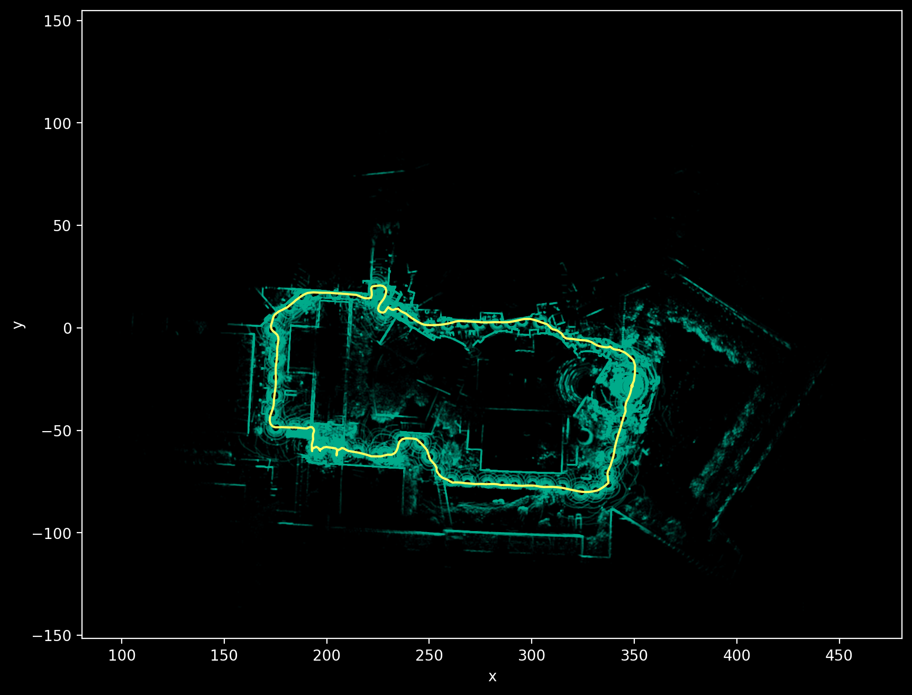
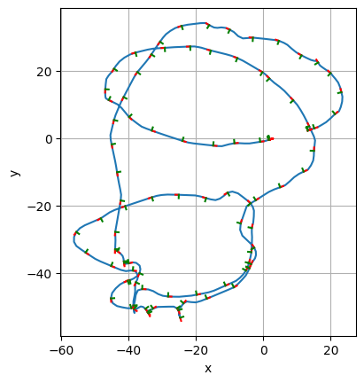

# robotdatapy

Welcome to `robotdatapy`! At its core, `robotdatapy` is a package designed to make accessing and manipulating robot/geometric data easy in Python.



## Install

`robotdatapy` is available via PyPi! To install:

```
pip install robotdatapy
```

Or to install the most recent version:

```
git clone git@github.com:mbpeterson70/robotdatapy.git
cd robotdatapy
pip install .
```

## Tutorial

The best way to get familiar with `robotdatapy` is through the introductory tutorial, accessible [here](./examples/intro_tutorial.ipynb).

## Data Interfaces

The primary use of this package is for interfacing with robot data. 
When developing offline robot applications, it can be difficult to deal with all of the different ways that data can be saved in (ROS bags, csv files, individual images, etc.). 
The goal of this package is to provide classes for loading data from a variety of sources, enabling a downstream task to use these data interfaces without needing to account for where that data is coming from. 

Additionally, when dealing with offline data, a user may want to get a camera image at a certain time as well as a robot pose estimate at that same time. 
However, pose estimates are often discrete and may not be synced with the camera image. 
This package provides a way of dealing with time synchronization between data via interpolation or finding the nearest datapoint to a requested timestamp.  

This README briefly describes three robot data classes: `PoseData`, `ImgData`, `PointCloudData`, and `ArrayData`. See the [examples folder](./examples/) for example Python notebooks of interacting with different robot data.

### PoseData

PoseData can load pose information from ROS1/2 bags, csv files, KITTI, or directly from a set of times and poses. 
Interpolation between poses is enabled by default, making it easy to get positions and orientations of a robot body at any time.
Additionally, a transformation can be specified to be pre-multiplied or post-multiplied (via the `T_premultiply` or `T_postmultiply` keyword argument) changing the reference frame given by the PoseData object.

To quickly plot the trajectory of a robot for example, you can run the following:

```python
import robotdatapy as rdp

bag_path = <path to bag>
topic = <Odometry or Pose msg>
pose_data = rdp.data.PoseData.from_bag(bag_path, topic=topic, interp=True)

pose_data.plot2d(dt=1.0, trajectory=True, pose=False)     # plots only position every second
pose_data.plot2d(dt=5.0, trajectory=False, pose=True)     # plots coordinate frames of the poses every 5 seconds
```


### ImgData

ImgData can be loaded from ROS1/2 bags, a zipped file of images, a numpy `npz` files of times and images, or directly from a list of times and cv images.
Depth images are supported as well.

Here's an example of loading and viewing an image from a ROS bag:

```python
import robotdatapy as rdp

img_data = rdp.data.ImgData.from_bag(
    bag_path,
    topic=<camera image topic>
    compressed=True # tells the loader that the images are ROS CompressedImage messages
)

img_data.show(img_data.t0) # shows the first image
```

### PointCloudData

PointCloudData can be loaded from ROS1/2 bags. Tools exist in `robotdatapy` to make transforming points or projecting points onto a camera image easy.

```python
import robotdatapy as rdp

ptcld_data = rdp.data.PointCloudData.from_bag(
    <ROS bag path>,
    topic=<ROS point cloud topic>,
)
```

### ArrayData

This class can be used for storing generic data. For example, discrete samples of position, velocity, and acceleration.
Linear interpolation can be turned on to enable accessing this data at any time.